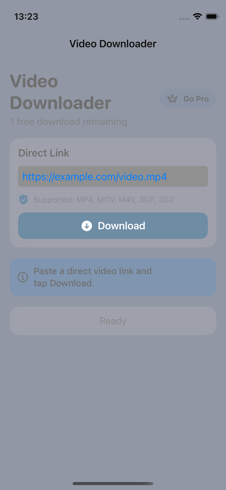
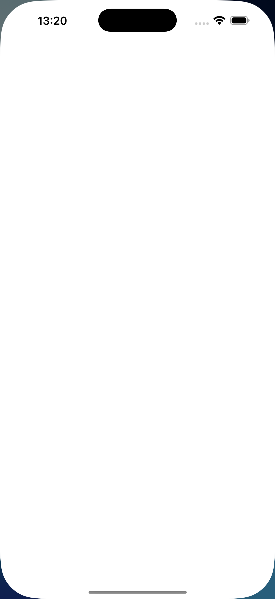
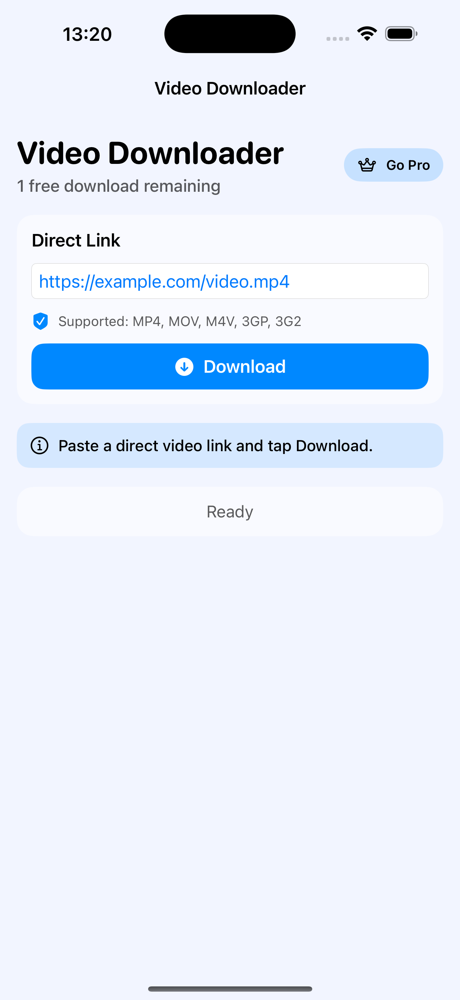

# Video Downloader

A focused iOS app for downloading supported videos from direct URLs, managing local storage, and gating extra usage behind a paywall.

## Features
- Direct-link input only (`mp4`, `mov`, `m4v`, `3gp`, `3g2`).
- One free download per day for non-subscribers.
- StoreKit paywall with:
  - Weekly subscription
  - Monthly subscription
  - Lifetime one-time purchase
- Local download management:
  - Rename
  - Hide/unhide via passcode vault
  - Delete
- Dedicated video progress, cancellation, and status messaging.
- Persistence of downloads, entitlements, and vault passcode.

## StoreKit IDs
- `videodownloader_weekly`
- `videodownloader_monthly`
- `videodownloader_lifetime`

## Showcase

  
  
  
  
  
  

