# Video Downloader

A focused iOS app for downloading supported videos from direct URLs, managing local storage, and gating extra usage behind a paywall.

## Features
- Direct-link input only (`mp4`, `mov`, `m4v`, `3gp`, `3g2`).
- One free download per day for non-subscribers.
- StoreKit paywall with:
  - Weekly subscription
  - Monthly subscription
  - Lifetime one-time purchase
- Local download management:
  - Rename
  - Hide/unhide via passcode vault
  - Delete
- Dedicated video progress, cancellation, and status messaging.
- Persistence of downloads, entitlements, and vault passcode.

## StoreKit IDs
- `org.icorpvideo.VideoDownloader.weekly`
- `org.icorpvideo.VideoDownloader.monthly`
- `org.icorpvideo.VideoDownloader.lifetime`

## Showcase
Click any preview to open the high-quality screenshot.

<table>
  <tr>
    <td align="center">
      
       
      Main Screen, 5 Videos (Light)
    </td>
    <td align="center">
      <a href="showcase/high/demo-link.png">
        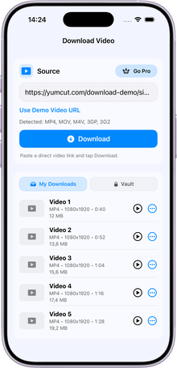
      </a>
       
      Demo Link In Input (Light)
    </td>
    <td align="center">
      <a href="showcase/high/downloading-process.png">
        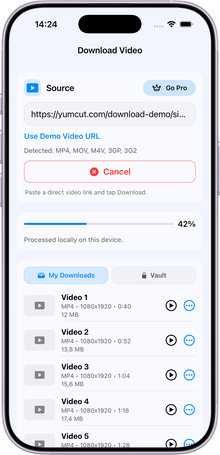
      </a>
       
      Downloading Process (Light)
    </td>
  </tr>
  <tr>
    <td align="center">
      <a href="showcase/high/video-menu-opened.png">
        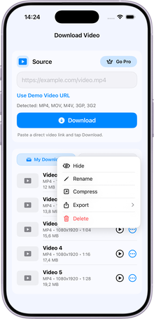
      </a>
       
      Video Menu Opened (Light)
    </td>
    <td align="center">
      <a href="showcase/high/video-export-opened.png">
        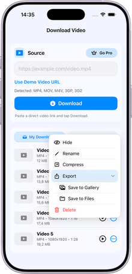
      </a>
       
      Export Menu Opened (Light)
    </td>
    <td align="center">
      <a href="showcase/high/rename-file.png">
        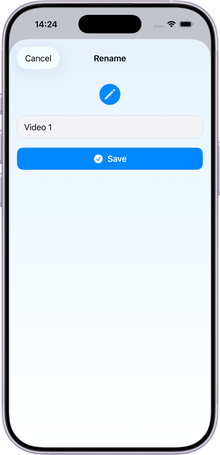
      </a>
       
      Rename File (Light)
    </td>
  </tr>
  <tr>
    <td align="center">
      <a href="showcase/high/vault-unlock-modal.png">
        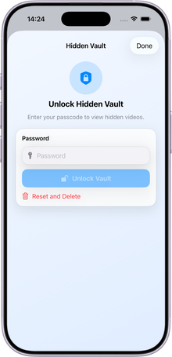
      </a>
       
      Vault Unlock Modal (Light)
    </td>
    <td align="center">
      <a href="showcase/high/vault-unlocked-videos.png">
        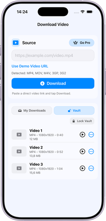
      </a>
       
      Vault Unlocked (Light)
    </td>
    <td align="center">
      <a href="showcase/high/main-videos-dark.png">
        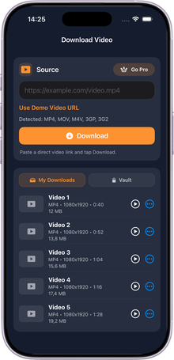
      </a>
       
      Main Screen, 5 Videos (Dark)
    </td>
  </tr>
  <tr>
    <td align="center">
      <a href="showcase/high/demo-link-dark.png">
        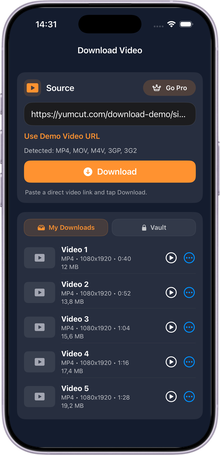
      </a>
       
      Demo Link In Input (Dark)
    </td>
    <td align="center">
      <a href="showcase/high/downloading-process-dark.png">
        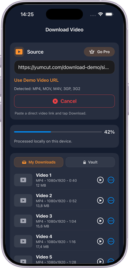
      </a>
       
      Downloading Process (Dark)
    </td>
    <td align="center">
      <a href="showcase/high/video-menu-opened-dark.png">
        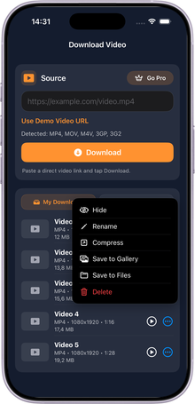
      </a>
       
      Video Menu Opened (Dark)
    </td>
  </tr>
  <tr>
    <td align="center">
      <a href="showcase/high/video-export-opened-dark.png">
        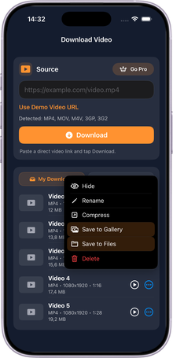
      </a>
       
      Export Menu Opened (Dark)
    </td>
    <td align="center">
      <a href="showcase/high/rename-file-dark.png">
        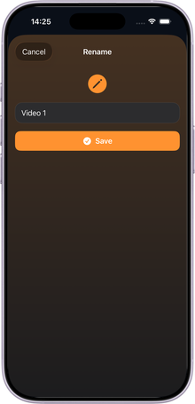
      </a>
       
      Rename File (Dark)
    </td>
    <td align="center">
      <a href="showcase/high/vault-unlock-modal-dark.png">
        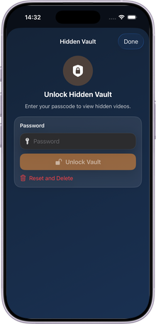
      </a>
       
      Vault Unlock Modal (Dark)
    </td>
  </tr>
  <tr>
    <td align="center">
      <a href="showcase/high/vault-unlocked-videos-dark.png">
        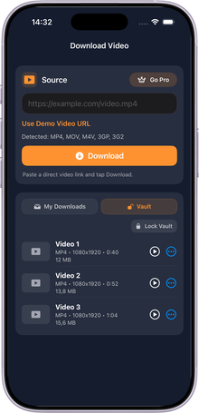
      </a>
       
      Vault Unlocked (Dark)
    </td>
    <td align="center">
      <a href="showcase/high/paywall-window.png">
        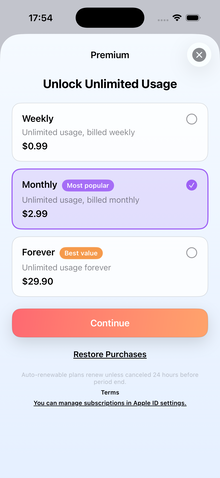
      </a>
       
      Paywall (Light)
    </td>
    <td align="center">
      <a href="showcase/high/paywall-window-dark.png">
        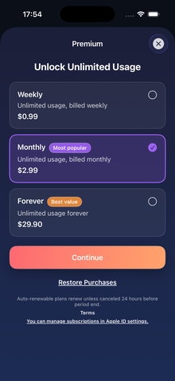
      </a>
       
      Paywall (Dark)
    </td>
  </tr>
</table>
